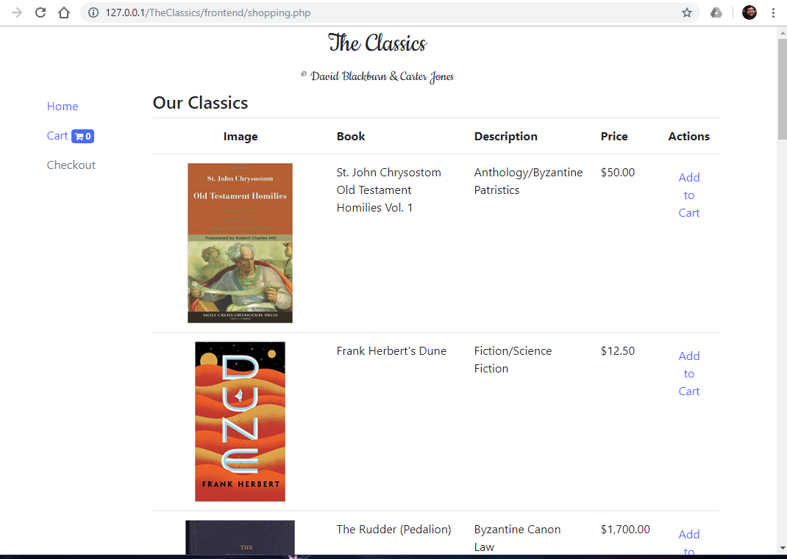
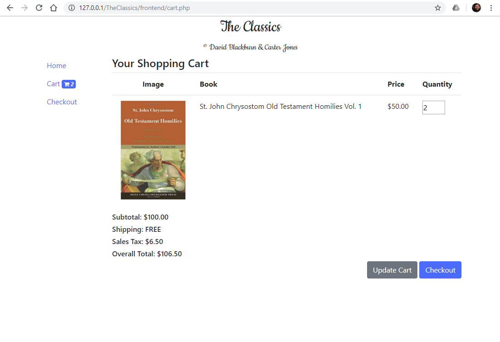
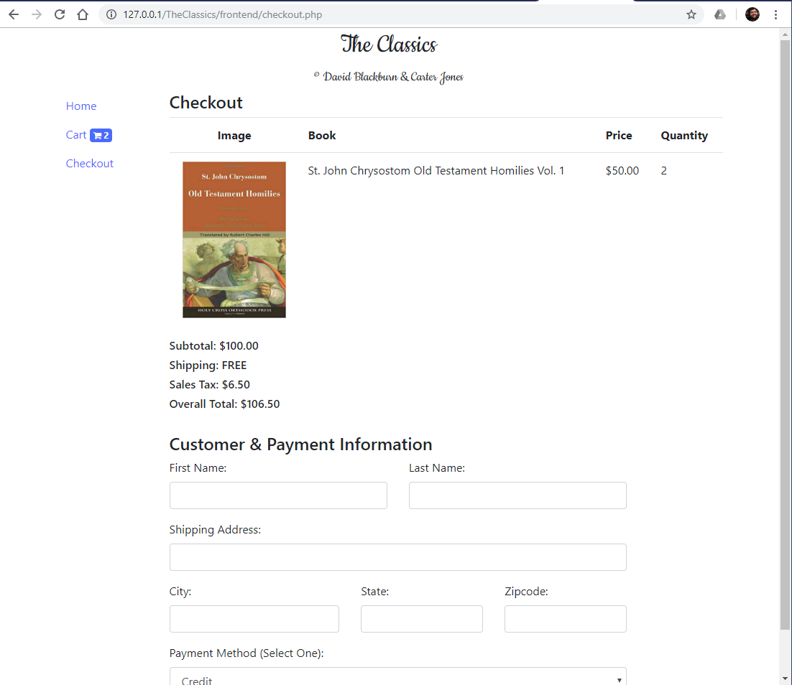
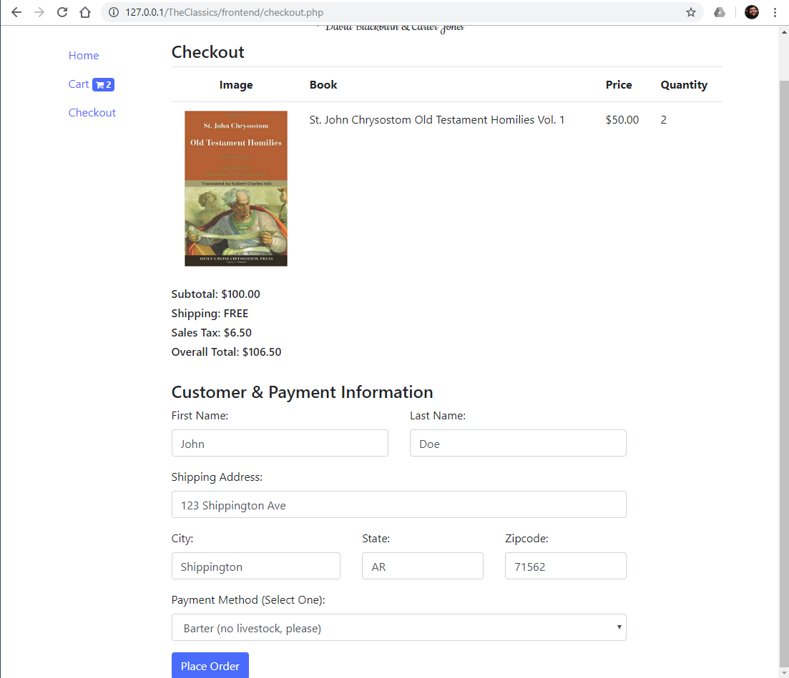
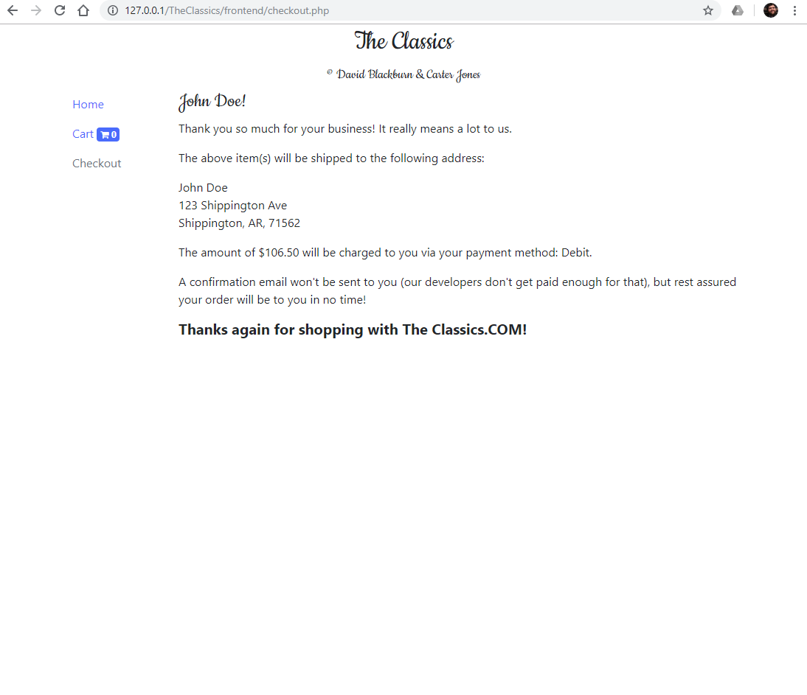

# ecommerce-example

This project is a mock e-commerce platform (TheClassics.COM) built with PHP and co-authored by developers David Blackburn and Carter Jones.

TheClassics.COM implements a shopping cart which is saved and manipulated within a session, populated with selected items from the shopping home page. The cart can be modified on the cart page (cart.php), and checking out takes place on the checkout page, where a user can specify shipping and payment info. At the end of the shopping session, the customer is thanked, a shipping receipt is displayed, and the session is reset so that the customer can begin shopping again.

As this is a mock-up, many things proper to an e-commerce platform have been omitted, but it could certainly be built out to be a functioning e-commerce site.

<b>The Home Page</b>

<b>The Shopping Cart</b>

<b>The Checkout Page</b>

<b>The Completed Checkout Form</b>

<b>The Receipt After Checkout</b>

